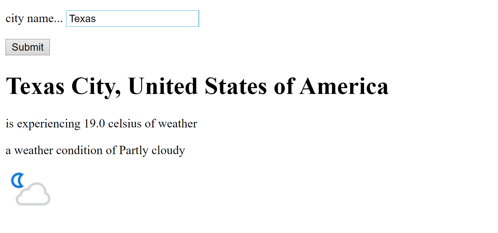
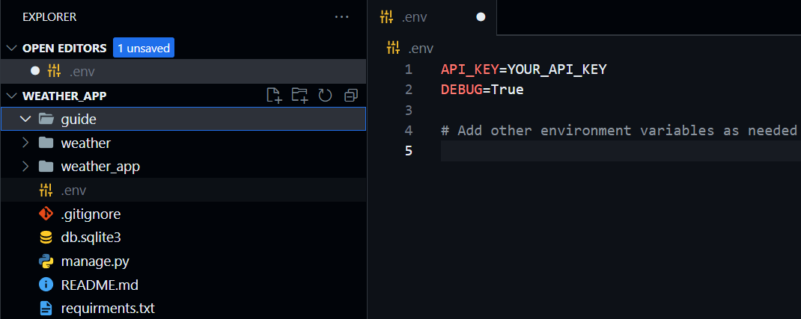

<a name="readme-top"></a>


<!-- TABLE OF CONTENTS -->


<h1 align="center">Weather Web App</h1>


<!-- ABOUT THE PROJECT -->
## About The Repo
A repo for BSIT 2A students. This is only a learner's module



<p align="right">(<a href="#readme-top">back to top</a>)</p>


### Built With


* [![Python][Python.org]][Python-url]
* [![Django][Djangoproject.com]][Django-url]

<p align="right">(<a href="#readme-top">back to top</a>)</p>


<!-- GETTING STARTED -->
## Getting Started

Download all the prerequisites below in order.

### Prerequisites
Download all of these to get started

* [Python](https://www/python.org)
* [Django](https://www.djangoproject.com)
* [Requests](https://pypi.org/project/requests/)
* [Decouple](https://pypi.org/project/python-decouple/) 

### Installation

_Once installed, open a command prompt, choose your directory wherein you want to save the project. Finally, clone the repo._


1. Clone the repo
   ```sh
   C:\Users\PC> git clone https://github.com/neekho/weather_app.git
   ```
2. Go to the project folder
   ```sh
   C:\Users\PC> cd weather
   ```
3. Create a superuser _Provide the neccessary information when prompt._
   ```sh
   C:\Users\PC\weatherapp> pip install -r requirements.txt
   ```
4. Create a .env in your project's root folder
   
5. Inside the .env file, write API_KEY=YOUR_ACTUAL_API_KEY, then on a new line, DEBUG=True

   
6. Run the local server either specify a port number or use the default (8000)
   ```sh
    C:\Users\PC\ceu> python manage.py runserver <OPTIONAL: PORTNUMBER>
   ```

_Once the local surver is running, open up a browser and go to http://localhost:8000/_


<p align="right">(<a href="#readme-top">back to top</a>)</p>

___________________________________________________________________________________________________


___________________________________________________________________________________________________


<!-- ROADMAP -->
## Roadmap

- [ ] Weather forecast
- [ ] CSS Design 


<p align="right">(<a href="#readme-top">back to top</a>)</p>

___________________________________________________________________________________________________

<!-- CONTRIBUTING -->
## Contributing

Contributions are what make the open source community such an amazing place to learn, and create. Any contributions you make are **greatly appreciated**.

If you have a suggestion that would make this better, please fork the repo and create a pull request. You can also simply open an issue with the tag "enhancement".
Don't forget to give the project a star! Thanks again!

1. Fork the Project
2. Create your Feature Branch (`git checkout -b feature/AmazingFeature`)
3. Commit your Changes (`git commit -m 'Add some AmazingFeature'`)
4. Push to the Branch (`git push origin feature/AmazingFeature`)
5. Open a Pull Request

<p align="right">(<a href="#readme-top">back to top</a>)</p>


<!-- MARKDOWN LINKS & IMAGES -->
<!-- https://www.markdownguide.org/basic-syntax/#reference-style-links -->


[Python.org]: https://img.shields.io/badge/Python-35495E?style=for-the-badge&logo=python&logoColor=white
[Python-url]: https://python.org/

[Djangoproject.com]: https://img.shields.io/badge/django-33415E?style=for-the-badge&logo=django&logoColor=white
[Django-url]: https://www.djangoproject.com


[Django-rest-framework.org]: https://img.shields.io/badge/DjangoRestframework-33415E?style=for-the-badge&logo=python&logoColor=white
[Drf-url]: https://www.django-rest-framework.org


[Sqlite.org]: https://img.shields.io/badge/SQLite-6d93d1?style=for-the-badge&logo=SQLite&logoColor=white
[Sqlite-url]: https://www.sqlite.org/index.html
